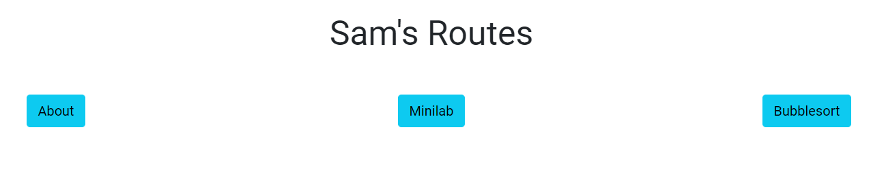
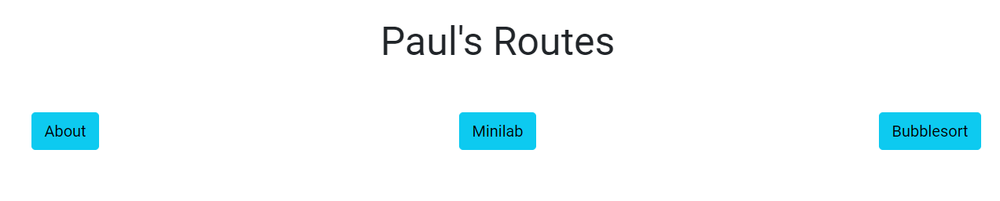
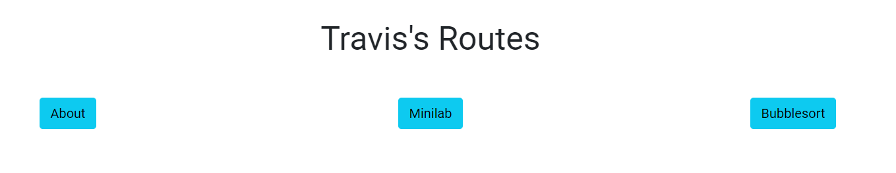
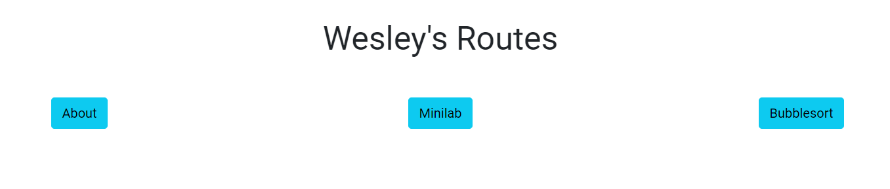

# Final Point Grading Justification
## Theme Section (5/5)
 - 4 Interactables (+2) and Data Driven page justification with code  (+2): 
    * [Login/Signup](https://github.com/Paul-Bokelman/styledweather-python/blob/master/routes/team/auth.py#L1-L58) 
        * Data driven page which stores user input into database. Data can be retrieved later to give access to dashboard of website.   
    * [Ideal weather user input](https://github.com/Paul-Bokelman/styledweather-python/blob/master/routes/team/auth.py#L76-L85) 
        * Data driven page which stores user's descriptions. Will be stored forever, and tells users what their ideal weather is.  
    * [Current weather search](https://github.com/Paul-Bokelman/styledweather-python/blob/master/routes/team/api.py#L8-L19)
        * Data driven page which uses API to tell weather and condition statistics. The statistics will be displayed on the page.
    * [Crossover team API interaction](https://github.com/Paul-Bokelman/styledweather-python/blob/master/routes/team/api.py#L51-L61)
        * Data driven page which accesses crossover team API. Select a user from the list, and find their "To Do" list from the API. 
  - Something fun/interesting on site! (+1)
    * User is able to find any weather information from ANYWHERE on the world. Feel free to explore each corner of the globe! 
  <details>
  <summary>Images for reference</summary>


   
  
  
  </details>
  
&nbsp;
___________________________
## Individual Section (5/5)
* 4 Individual labs (+4)
<details>
<summary>Paul</summary>


  * [Paul's page](https://fish.nighthawkcodingsociety.com/paul)
  * [About page code](https://github.com/Paul-Bokelman/styledweather-python/blob/master/routes/paul/about_paul.py)
  * [Bubble Sort code](https://github.com/Paul-Bokelman/styledweather-python/blob/master/routes/paul/paul_bubblesort.py)
  * [Minilab](https://github.com/Paul-Bokelman/styledweather-python/blob/master/routes/paul/paul_minilab.py)
</details>

<details>
<summary>Sam </summary>


* [Sam's page](https://fish.nighthawkcodingsociety.com/sam)
* [About page code](https://github.com/Paul-Bokelman/styledweather-python/blob/master/routes/sam/about_sam.py)
* [Bubble Sort code](https://github.com/Paul-Bokelman/styledweather-python/blob/master/routes/sam/sam_bubblesort.py)
* [Minilab](https://github.com/Paul-Bokelman/styledweather-python/blob/master/routes/sam/sam_minilab.py)
</details>
<details>
<summary>Wesley</summary>


* [Wesley's page](https://fish.nighthawkcodingsociety.com/wesley)  
* [About page code](https://github.com/Paul-Bokelman/styledweather-python/blob/master/routes/wesley/about_wesley.py)
* [Bubble Sort code](https://github.com/Paul-Bokelman/styledweather-python/blob/master/routes/wesley/wesley_bubblesort.py)
* [Minilab](https://github.com/Paul-Bokelman/styledweather-python/blob/master/routes/wesley/wesley_minilab.py)
</details>
<details>
<summary>Travis</summary>


* [Travis's page](https://fish.nighthawkcodingsociety.com/travis)
* [About page code](https://github.com/Paul-Bokelman/styledweather-python/blob/master/routes/travis/about_travis.py)
* [Bubble Sort code](https://github.com/Paul-Bokelman/styledweather-python/blob/master/routes/travis/travis_bubblesort.py)
* [Minilab](https://github.com/Paul-Bokelman/styledweather-python/blob/master/routes/travis/travis_minilab.py)
</details> 
&nbsp;

- 2 Technicals (+1)
  * [Blueprint organization for individual areas](https://github.com/Paul-Bokelman/styledweather-python/blob/81050ce2e87bab58a690581f157ea59da9e94a61/app.py#L23-L34)
```py app.register_blueprint(about_paul.about_paul)
app.register_blueprint(paul_bubblesort.paul_bubblesort)
app.register_blueprint(paul_minilab.paul_minilab)
app.register_blueprint(about_sam.about_sam)
app.register_blueprint(sam_bubblesort.sam_bubblesort)
app.register_blueprint(sam_minilab.sam_minilab)
app.register_blueprint(about_travis.about_travis)
app.register_blueprint(travis_bubblesort.travis_bubblesort)
app.register_blueprint(travis_minilab.travis_minilab)
app.register_blueprint(about_wesley.about_wesley)
app.register_blueprint(wesley_bubblesort.wesley_bubblesort)
app.register_blueprint(wesley_minilab.wesley_minilab)
```

- Each page looks the same and is easy to navigate. Accessing each page can be done through the dropdowns and buttons.
<details><summary>Images for refrence (Dropdown)</summary>






</details>
&nbsp;

# Project Plan: 
## "Stylized Weather" 
 - An interactive weather site with dynamic weather system to show real time data of climate, temperature, time, weather, and more.
 - Custom designs will be assigned to each type of weather, making a more fluid and connected theme on the website
 - Users will be able to input "opinions" about the weather when logged in
 - Looking to use 3 databases for login/signup, API, and opinions list
    
### Crossover API - same style, different job
    - Todos - other group's shared API, make reminders!
    - similar style as rest of site, custom to API group
    - Crossover API will be held here
   
### About Page - About the team
    - have our favorite weather
    - fun facts and images representing us through weather
    - contains minilabs and bubble sorts
     
 ### Sign up 
    - Login and create account to make your own weather on our site and your ideal weather!
    
 ### Making your ideal weather
    - Can create fake city name and ideal weather to display on the site
    - Same style/art as actual weather for current location
    
 ## Current Indivdual Focus:
  - Travis - Crossover API
  - Paul - Making API
  - Sam - Sign in page/About page
  - Wesley - Nav bar/approutes
  
-Blueprints:
  - app.py is login and logic - has secret route
  - Siteroutes.py - made to show all static HTML
  - apiroutes.py - made for all API information for other group
  - Blueprint is a way to break apart the routes
- Indivdual blueprint to-do:
  - Travis - everything with secret route
  - Paul - All API routes
  - Sam - Routes for pages of site
  - Wesley - Routes for static HTML
  
  # Dependencies - download to work

1. flask
2. flask-wtf
3. wtforms
4. flask-sqlalchemy
5. werkzeug
6. flask-login
7. email-validator


 # Mini Lab
    
Paul - https://github.com/Paul-Bokelman/styledweather-python/commit/5caa57509d33f2e6e4f08dbdd4fe178897b5d983

For point 1 I wrote all of my new class & object code in my corresponding blueprint section (/paul)
On line 4 of the paul.py file I defined the class Info to hold data about myself. 
```class Info:
    name = "Paul"
    lang = "javascript"
    desc="I am Paul Bokelman and I really enjoy coding and making cool projects on the internet and solving problems. I also have a very adorable dog."
    github="https://github.com/Paul-Bokelman"
 ```
3. From this class I defined a variable to which I can access the different data pieces (object) info = Info()
4. I then displayed the objects by passing them to the html using jinja and rendering them. (line 14)
5. 1 wow that I had was using a link to display as a link in an anchor tag in the html.

Wesley - https://github.com/Paul-Bokelman/styledweather-python/commit/0919676599208c94da8dd70bb90f844ac4954fbf 

```class Info:
    name = "Wesley"
    lang = "HTML"
    desc="My name is Wesley Chen. I like Python and the logic it requires. Comp Sci is an interesting topic to learn about, and I feel that I have really enjoyed my time here learning code. I play video games in my free time."
    github="https://github.com/WesleyChen1"
```
1. The class and object code was writen in the idividual file with the root: /wesley
2. Starting in line 4, the class named **Info** was defined. It is written to assigns 4 variables : name, lang, desc, and github
3. On line 10, the object is assigned. the object name is info and will be used later to create the outputs
4. The data is displayed by rendering the template. The data is first passed to individual.html and uses jinja templating (similar to navbars) to create identicle webpages for everyone, but with different individual information.
5. The WOW factor would be defining the object and moving the data from the object to another html file. This html file, which used jinja, would repeat and create the web pages identically to everyone elses.


Travis- https://github.com/Paul-Bokelman/styledweather-python/commit/0919676599208c94da8dd70bb90f844ac4954fbf
```name = "Travis"
    lang = "CSS"
    desc="My name is Travis Medley and I love CSS, I like to hangout with friend and play videogames in my free time. I like going to the gym and I currently do swim for DN."
    github="https://github.com/Travis4th"
```
1. The objects and the classes have their indivdual file name and teh root for mine is /travis
2. The class called INFO was definded and is showing 4 different variables for me. name, favorite language, description and github.
3. on line 10 the object is assigned and the name is info and will later create outputs.
4. The data is shown by rendering the template. The data goes through the indivdual.html and templates it in our indivadual page for each of us.
5. Our WOW is showing how we can define the object and put it into the template to display is on our indivdual pages.


Sam - https://github.com/Paul-Bokelman/styledweather-python/commit/0919676599208c94da8dd70bb90f844ac4954fbf
```name = "Sam"
    lang = "HTML/CSS"
    desc = "My name is Sam Koenig and I like to code in HTML and CSS. CSP is currently my favorite class because I get to be creative when making web pages."
    github = "https://github.com/samkoenig9"
```
1. My individual root is /sam for the objects and classes.
2. The Info class is defined and shows 4 variables that relate to different things about me: name, favorite language, description, and my github.
3. The object is assigned on line 10 and given the name Info.
4. The page is shown by rendering template. The data goes through individual.html and uses variables from our own files.
5. The WOW is us showing how to define objects and put them into the template on each individual page.

## Api

Our API is one of the more impressive feats of computer science engineering in our project. Not only do we have a fully functional API that can relay data from our local database to other origins, we also have a template and logic dedicated to integrating our crossover teams own API. On top of this our home page is rendered from our api file because behind the pretty template we take the form input and use it to get the current data for the location from a public weather api.

### Global weather search

If you have ever visited [styled-weather](https://fish.nighthawkcodingsociety.com/) you'll know that you are immediately presented with a beautiful search bar and display of the current weather in your area, but behind the well organized html and css what is happening?

Contrary to what many may think, handling the search process is actually incredibly simple. It all starts with our [public api](http://api.weatherapi.com) that we are accessing data from, by default you can pass a query (q) parameter in the url in order to get back certain data for a location, for example with a valid API key the url, http://api.weatherapi.com/v1/forecast.json?q=San%20diego would return the current weather data for San diego. The information is useful to understand because what we can do is get the users input through flasks request module then simply use string concatenation to input the incoming value into the request to get back the corresponding data back.

```py
userLocation = request.form.get('location', 'san diego')
x = requests.get(f"http://api.weatherapi.com/v1/forecast.json?q={userLocation}", headers={"content-type":"application/json", "key":"YOUR API KEY"})
```

The response is then deconstructed into several variables to then render in the home.html template.

### Routes

Our application has 3 custom API routes that all serve different purposes. One of the main things that we focused on when engineering our API routes was that we wanted them to be very simple for another developer to use, this includes the route itself being specific as well as the response data being structured nicely.

#### [/all_ideal_weathers](https://fish.nighthawkcodingsociety.com/all_ideal_weathers)

Method: **GET**

The /all_ideal_weathers route is very simple in that it simply gets all of the entries in the IdealWeather table from the database then returns the response in the form of an array to be easily iterated over by another developer.

You can checkout the source code for this route [here](https://github.com/Paul-Bokelman/styledweather-python/blob/e9d71e7f3d5a101eb3d5a05a715307af3e26aaaf/routes/team/api.py#L42-L49).

#### [/get_ideal_weather/username](https://fish.nighthawkcodingsociety.com/get_ideal_weather/Paul)

Method: **GET**

One of the more impressive and helpful routes is the /get_ideal_weather/username route. This route takes a url parameter (username), this parameter is the username of an already registered user, if the username inputted is indeed a valid user then the response will include that particular users ideal weather.

For example if I wanted to see the ideal weather for the user of "Paul" I would make a request to /get_ideal_weather/Paul, the response of this request would be:

```json
{
  "username": "Paul",
  "ideal_weather": {
    "date_added": "Sat, 15 May 2021 02:46:11 GMT",
    "condition": "cloudy",
    "temp": 64,
    "desc": "A very cloudy day"
  }
}
```

You can checkout the source code for this route [here](https://github.com/Paul-Bokelman/styledweather-python/blob/e9d71e7f3d5a101eb3d5a05a715307af3e26aaaf/routes/team/api.py#L21-L31).

##### [/all_users](https://fish.nighthawkcodingsociety.com/all_users)

Method: **GET**

Similar to the logic of the /all_ideal_weathers route the /all_users route simply queries through the User table, gets all of the entries and returns the username field for each.

You can checkout the source code for this route [here](https://github.com/Paul-Bokelman/styledweather-python/blob/e9d71e7f3d5a101eb3d5a05a715307af3e26aaaf/routes/team/api.py#L33-L40).

### Crossover

Our crossover group was [p2anteaters](https://p2anteaters-todos.tk/), this group created a "todo" list application so the data that we pulled from their api was a particular users "todos" filtered by username.

Similar to our API routes they also had an /all_users route as well a route to get all the todos of a particular user. With this limited data we decided to first get all the users then use that data to allow for the user to choose which todo user they want to get the todo back for.


Check out the [page](https://fish.nighthawkcodingsociety.com/crossover) and the source code for the [python](https://github.com/Paul-Bokelman/styledweather-python/blob/e9d71e7f3d5a101eb3d5a05a715307af3e26aaaf/routes/team/api.py#L51-L61) and [html](https://github.com/Paul-Bokelman/styledweather-python/blob/master/templates/crossover.html).

The anteaters also used our api to display data from our database on their site! Check it out [here](https://p2anteaters-todos.tk/crossover_api).
